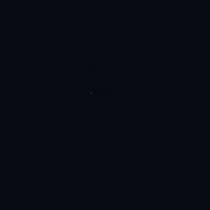

# AMBER-ROOM-GALLERY
AMBER ROOM: A cinematic, high-resolution secure vault. Built natively on Cloudflare to deliver a zero-reload browsing experience with fluid animations and rate-limiting protection.

# 💎 AMBER ROOM · Ultra-Premium Secure Gallery

<div align="center">
  
  
  <h1>💎 AMBER ROOM · Ultra-Premium Secure Gallery</h1>
  
  <p>
    
    
    
  </p>
  
  <p><i>A serverless, high-resolution visual vault engineered for luxury brand experiences. Built natively on Cloudflare's global edge infrastructure to deliver zero-reload browsing, 120fps fluid transitions, and hardened authentication.</i></p>
</div>

---

## ✨ Features

- **Single Page Application (SPA):** Seamless transitions between collections without full browser reloads.
- **Magnetic UX & Custom Cursor:** Physics-driven cursor reaction and magnetic interactions for desktop pointers.
- **Cinematic Parallax & Blur-Up:** Asynchronous image decoding, skeleton place-holders, and depth-scrolling hero banners.
- **Touch Gestures & Lightbox:** Pinch-to-zoom, pan, swipe navigation, and keyboard shortcuts (`←`, `→`, `Esc`).
- **Fortified Security:** SHA-256 hashed session validation and auto-managed Brute-Force Rate Limiting via KV.

---

## ⚙️ Cloudflare Bindings Configuration

Configure the following bindings under **Settings > Functions > Variables & Bindings** in your Cloudflare Pages dashboard.

| Binding Type | Variable Name | Required | Description |
| :--- | :--- | :--- | :--- |
| **R2 Bucket** | `GALLERY_BUCKET` | Yes | Target R2 bucket storing all curated gallery photographs and hero assets. |
| **KV Namespace** | `CONFIG_KV` | Yes | Key-Value store managing passwords, branding configuration, and brute-force rate limits. |

---

## 🔑 KV Namespace Records (`CONFIG_KV`)

Add the following exact keys to your bound KV Namespace to control the gallery:

| Key | Type | Default Value | Description |
| :--- | :--- | :--- | :--- |
| `PASSWORD` | String | `admin123` | Master passphrase required to unlock the gallery vault. |
| `SITE_TITLE` | String | `AMBER` | Primary branding display text on the header. |
| `SITE_SUBTITLE` | String | `ROOM` | Secondary accent title shown below the brand mark. |

---

## 📁 R2 Bucket Structure

Maintain the exact directory taxonomy inside your Cloudflare R2 bucket:

```text
GALLERY_BUCKET/
├── Header/
│   ├── 1.jpg              # Primary Hero Image
│   ├── 2.jpg              # Transition Slide 2
│   └── 3.jpg              # Transition Slide 3
├── Architecture/
│   ├── 001.jpg
│   └── 002.jpg
└── Portraits/
    ├── portrait-1.jpg
    └── portrait-2.jpg

---

## ⚖️ License & Intellectual Property

**AMBER ROOM · Ultra-Premium Secure Gallery** is an independent architectural masterpiece conceptualized and engineered by **Thiha Aung (Yone Man)**.

### 📜 Usage Rights & Restrictions
- **Personal & Educational Use:** Developers are highly encouraged to fork, study the edge-computing architecture, and deploy this system for strictly personal, non-commercial vaults.
- **Attribution Mandate:** Any public deployment, modification, or inspiration drawn from this source code MUST unequivocally retain the original creator's credits (`Created by Thiha Aung`) within the UI and source files.
- **Commercial Prohibition:** Unauthorized commercial distribution, enterprise repackaging, reselling as a service (SaaS), or white-labeling this codebase without explicit written consent is strictly prohibited.

### 🛡️ Zero-Liability Security Disclaimer
This system leverages state-of-the-art edge security protocols (SHA-256 cryptographic hashing, KV-based brute-force mitigation). However, this software is provided **"as is"**, without warranty of any kind. The architect and original creator assumes zero liability for any data exposure, unauthorized vault access, or consequences arising from misconfigured Cloudflare environments.

> **Copyright © 2026 Thiha Aung (Yone Man). All Rights Reserved.** <br>
> *For standard open-source terms, please review the associated `LICENSE` file.*
